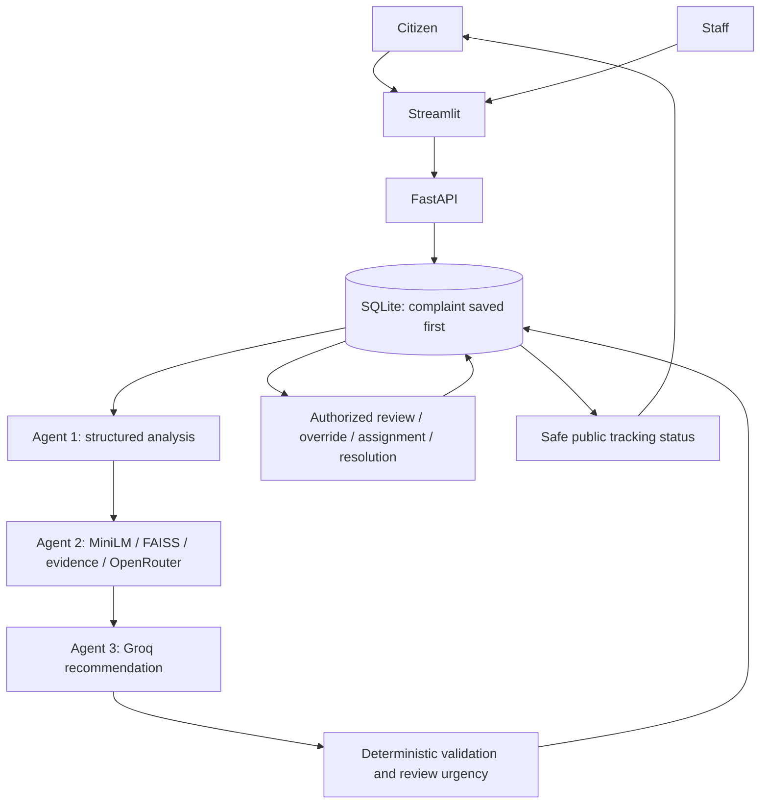

# SmartWaste AI

An evidence-supported waste complaint triage and case-management application for a university
demonstration. Citizens submit and track complaints; authorized staff inspect AI evidence,
approve or override recommendations, assign a team and record resolution.

The three-agent pipeline remains intact: structured complaint analysis, local RAG knowledge
retrieval, then a decision model and deterministic validation. AI recommendations require
staff sign-off before assignment. This project does not establish legal deadlines or
automatically dispatch crews.

## Architecture



Successful stage outputs are checkpointed. Provider failures leave a saved case and safe
failure status; bounded retries reuse successful stages. The default deployment processes
requests synchronously with two concurrent pipelines in one backend worker.

## Setup

Tested locally on Windows 11 with Python **3.13.9**. CI targets Python 3.13 on Linux.
`requirements.txt` pins tested direct dependencies; transitive libraries remain resolved
by pip. `requirements-member4.txt` is a compatibility alias for the same integrated set.

```powershell
python -m venv .venv
.\.venv\Scripts\Activate.ps1
python -m pip install -r requirements.txt
python -m pip check
```

Create a local `.env` from `.env.example`. Replace the JWT secret and bootstrap administrator
password locally with strong unique values. Never commit that file or share credentials.
Provider keys are optional for the mock demonstration.

- `USE_MOCK_AGENTS=true`: deterministic synthetic analysis/evidence, visibly labelled demo.
- `USE_MOCK_AGENTS=false`: configure Agent 1 OpenRouter (or Gemini when no Agent 1 OpenRouter
  key is set), Agent 2 OpenRouter and Agent 3 Groq. Model names are configurable.
- Gemini is an alternate configured Agent 1 path, not automatic failover after a rejected
  OpenRouter request. Provider/model availability must be checked separately.
- Settings are loaded once at startup; restart after changing configuration.

Initialize and run:

```powershell
python -m backend.database
python -m uvicorn backend.main:app --no-access-log
```

In another terminal using the same environment:

```powershell
python -m streamlit run frontend/app.py
```

Startup also initializes the database safely and creates the configured admin only if that
username does not already exist. Restart never resets stored passwords or reactivates accounts.
Public registration only creates normal users; an admin can promote accounts through
`PATCH /auth/users/{username}`. Never use the CI test signing key for deployment.

### Database initialization, migration and backup

Default database: `data/smartwaste.sqlite3`, ignored by Git. Migrations add tables/columns and
preserve records; a newer unsupported schema is rejected. Re-running initialization is safe.
Previously session-only complaints and in-memory users cannot be recovered automatically.

For a consistent backup, stop the local backend and copy the database file to a private
backup location. To reset a disposable demo, stop the backend, move the database aside as a
backup, then initialize a fresh database. Do not delete your only copy of real records.
Do not commit databases, backups, tokens or generated index files.

Retention previews only expired resolved cases:

```powershell
python -m backend.maintenance
```

After reviewing the preview and backing up, an operator may explicitly add `--apply`.
Nothing is automatically deleted on startup. See [privacy and operations](docs/privacy-operations.md).

## Knowledge base and evidence

Five supplied PDFs retain their historical filenames. [Source manifest](retrieval/sources.json)
records actual titles, issuers, years, jurisdictions and hashes, correcting misleading labels
without breaking paths.

MiniLM creates 384-dimensional embeddings. FAISS IndexFlatIP searches normalized vectors.
The system retrieves candidates and retains up to five diverse passages, then applies the
unchanged inclusive similarity threshold **0.35**. Similarity is not probability or factual
confidence. Conservative contents/reference filtering records its exclusions during rebuild.

```powershell
python -m retrieval.vector_store.faiss_store
```

This explicitly rebuilds local generated files and writes `build_info.json`. Source hashes
must match the reviewed manifest. Restart the backend after rebuilding because the model and
index are cached. Initial use requires downloading the embedding model; deterministic tests
do not require that model or a generated index. Duplicate suggestions use only a locally
cached MiniLM model and report unavailable if it is missing.

Staff can inspect official source titles, PDF page numbers, exact passages and semantic scores.
Numbered answer citations are checked against retained evidence and actual PDF text; invalid
references are removed and review is required. Legal/quantity screening is a conservative
review aid, not semantic entailment or legal verification. The legacy `grounded` field means
evidence-conditioned generation; it is not proof of truth. UI wording uses evidence availability
and 'not independently verified'. Confidence is explicitly model-reported and uncalibrated.

## Complaint workflow

```text
Submitted -> Processing -> Awaiting Review -> Reviewed -> Assigned -> Resolved
                 |
                 +-> Processing Failed -> retry (bounded), or manual override -> Reviewed
```

Review uses a reason and an optimistic version check. Stale or invalid transitions return 409.
Assignment requires an approved/overridden human decision. Resolution requires an assigned case.
Original AI outputs remain distinct from the human action and priority.

Optional duration, hazard observations and a public area/landmark help clarify a complaint.
Submission is allowed without them. Missing extracted facts generate predefined staff follow-up
questions. [Triage policy](docs/triage-policy.md) separates collection priority from review urgency;
high-severity/hazardous cases appear in the urgent-review group.

The backend generates a random 128-bit tracking capability plus an internal UUID. Keep tracking
IDs private. Tracking shows only status/timestamps and safe follow-up prompts, not complaint
text, staff comments or provider errors. The UI reuses an idempotency key when retrying the
same form payload. API clients should send a stable `Idempotency-Key` of 16–128 characters.

Possible duplicates require an explicitly supplied matching area, a recent time window and
semantic similarity. Staff must confirm a link; neither submission is merged or deleted.
Dashboard metrics come from stored rows and identify demo/live/unknown processing modes.

## API

| Route | Access / purpose |
|---|---|
| POST /complaints | Public persisted submission; returns tracking even if AI processing fails |
| GET /complaints/track/{tracking_id} | Public capability lookup, safe fields only |
| POST /complaints/process | Compatibility route; original successful FinalResponse contract, now persisted |
| POST /auth/register, /auth/login | Public normal-user registration and login |
| GET /auth/users; PATCH /auth/users/{username} | Admin-only account listing / role / active state |
| GET /staff/complaints | Staff/admin queue: status, priority, review_needed, search, limit, offset |
| GET /staff/complaints/{id} | Staff/admin case and internal history |
| POST /staff/complaints/{id}/review | approve/override with version, reason; override also priority/action |
| POST /staff/complaints/{id}/assign | version and assignee |
| POST /staff/complaints/{id}/resolve | version and staff-only resolution note |
| POST /staff/complaints/{id}/retry | bounded retry; active processing rejected, stale lease recoverable |
| GET /staff/complaints/{id}/duplicates | optional duplicate suggestions |
| POST /staff/complaints/{id}/duplicate | other_id and reason; staff-confirmed link only |
| GET /staff/dashboard | aggregates from persisted records |
| POST /agents/analyze, /agents/retrieve, /agents/decide | Admin-only debugging |
| GET /health | Process liveness |
| GET /ready | Safe DB/file/provider-configuration checks, not proof of working credentials |

JWT signature/expiry are checked, then the subject is looked up in SQLite. Disabled/deleted
accounts are rejected; current database roles control access. See `/docs` locally for schemas.
The process compatibility route can return a saved tracking ID with 502 on processing failure,
or 202 for a manually handled case without complete AI output. New clients should use /complaints.

## Tests and evaluation

```powershell
python -m tests.test_rules_no_api
python -m unittest tests.test_integration -v
python -m unittest tests.test_rag_evidence tests.test_decision_safety tests.test_faiss_build -v
python -m unittest discover -s tests -v
```

Tests use temporary databases, synthetic fixtures and mocked provider boundaries. They include
cross-client workflow, independent interpreter restart persistence, authorization, transitions,
failure recovery, input/rate/body limits, frontend rendering, PDF metadata/citations, triage,
duplicate links, dashboard queries and evaluation metrics. The printed rules script is a manual
example script, not seven additional automated tests. `test_waste_analyzer.py` is a manual live
provider smoke script; ordinary unittest discovery does not invoke its main function.

[Evaluation guide](evaluation/README.md): 60 generated candidates are **UNREVIEWED** and the
reviewed dataset starts empty. A human team must annotate references before accuracy reporting.
Results include per-metric denominators. Null means unavailable; no accuracy gain is claimed.
Do not treat generated candidate labels as ground truth.

```powershell
python -m evaluation.run_system_eval --dataset evaluation/complaints.template.json --variant rules
python -m evaluation.run_retrieval_eval --variant baseline
```

Live evaluation is explicitly opt-in with `--live` and a small limit. No monetary cost estimate
is fabricated. CI runs deterministic checks without external credentials or a full FAISS index.

## Best 5-minute lecturer demo

1. Start backend/frontend in labelled mock mode for a predictable demonstration.
2. In citizen browser A, submit routine waste with duration and a public landmark. Save the tracking ID.
3. In separate browser B, sign in as staff/admin. Open that same persisted case.
4. Inspect original complaint, extracted facts, evidence, model recommendation and validation.
   Explain that mock evidence is synthetic; use a separately verified live run to demonstrate real RAG.
5. Approve with a reason (or override priority/action), assign a team, then mark resolved.
6. In browser A, look up the ID and show the updated safe status.
7. Submit an affirmative chemical/syringe complaint and show urgent human review.
8. Briefly show actual dashboard counts and mode labels. If time permits, restart the backend
   and look up the original ID again. Provider-failure persistence is covered by deterministic tests.

## Limits and next steps

No evaluated multilingual support, autonomous dispatch, image recognition, IoT or route
optimization is claimed. [Multilingual plan](docs/multilingual-plan.md) is design-only.
The default rate/concurrency limits are process-local and SQLite suits this single-host demo;
distributed deployment needs shared controls and further operational work. Clarification is
optional initial input plus staff follow-up prompts, not an automated conversational agent.
Negation and sensitive-claim checks are limited heuristics. Corpus filtering is deliberately
conservative; real quality improvements require reviewed benchmark results. See
[implementation log](docs/implementation-log.md) for phase verification.
