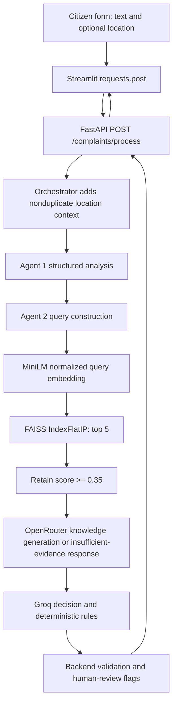

# Verified final architecture

The actual request starts in Streamlit and enters FastAPI before the agents run. FastAPI orchestrates the agents; it is not a downstream stage after the decision.

## Verified code and parameters

| Component | Actual implementation | Code reference |
|---|---|---|
| Agent 1 | OpenRouter when its Agent 1 key is set; Gemini selected only when that key is absent, not automatic failover after an OpenRouter error | `agents/waste_analyzer/agent.py:107` |
| Structured analysis | waste types, location, duration, severity, issue type, summary | `agents/waste_analyzer/schemas.py`, `backend/schemas.py` |
| Query | Combines waste types, issue, location, duration and summary; exact-string part deduplication only | `agents/knowledge_agent/rag_agent.py:60` |
| Embeddings | `sentence-transformers/all-MiniLM-L6-v2`; 384 dimensions; cached SentenceTransformer | `retrieval/processing/embedder.py:11`, `retrieval/vector_store/retriever.py:34` |
| Chunking | 1,000 characters, 200-character overlap, 50-character minimum; page-based text; not token counts | `retrieval/processing/chunker.py:12` |
| PDF ingestion | PyMuPDF page text, whitespace cleaning; pages without extractable text skipped | `retrieval/ingest.py` |
| Similarity | Both stored and query vectors L2-normalized; inner product equals cosine similarity for these normalized vectors | `retrieval/vector_store/faiss_store.py:72`, `retrieval/vector_store/retriever.py:48` |
| Index and retrieval | `IndexFlatIP`, exact flat inner-product search, default top-k 5 | `retrieval/vector_store/retriever.py:66` |
| Evidence filtering | Individual `score >= 0.35`; no qualifying chunks returns grounded false and empty evidence/sources | `agents/knowledge_agent/rag_agent.py:193` |
| Provenance | `chunk_id`, filename, 1-based PDF page, text, score; sources rebuilt from retained chunks | Same file; `backend/schemas.py` |
| Agent 2 generation | OpenAI-compatible SDK to OpenRouter HTTPS; numbered evidence citations requested in prompt | `agents/knowledge_agent/rag_agent.py:158` |
| Grounded flag | Set true for a nonempty provider answer after qualifying evidence exists; claims are not semantically verified | `agents/knowledge_agent/rag_agent.py:253` |
| Agent 3 | Groq chat completion, JSON extraction, source-name checks, risk/review rules | `agents/decision/agent.py`, `agents/decision/rules.py` |
| Risk scan | Original complaint plus Agent 1 fields; excludes Agent 2 snippets and Agent 3 prose; substring keywords do not understand negation | `agents/decision/rules.py:124` |
| Final validation | Missing evidence, non-grounded answer, empty action, unknown sources, low confidence, failed decision validation, high severity and critical priority can require review | `backend/services/validator.py` |
| Build validation | Current chunk count, metadata count, 384 dimension; optional separate build metadata | `retrieval/vector_store/faiss_store.py:115` |

The actual local index dimensions/type were also observed at runtime. It still contains 2,716 vectors, but the build validation no longer requires that number. A three-vector fixture passed validation.

## Access boundaries

| Route | Access |
|---|---|
| `POST /complaints/process` | Intentionally public |
| `POST /auth/register`, `POST /auth/login` | Public account registration and login |
| `GET /health` | Public health response |
| `POST /agents/analyze`, `/agents/retrieve`, `/agents/decide` | Bearer JWT and exact `admin` role required |
| FastAPI documentation | Default FastAPI documentation routes; no additional dependency declared |

Passwords are hashed with bcrypt. Login signs a JWT with `sub`, `role`, and `exp`. `OAuth2PasswordBearer` obtains the bearer token; PyJWT validates its signature and expiry using the configured algorithm. `require_role("admin")` rejects a valid normal-user token with HTTP 403. Accounts are process-local dictionaries. Those architectural limitations are documented, not changed in this audit.

Streamlit sends complaint JSON and login form data through Python `requests.post`. Staff state is held in the Streamlit session. The selected location is sent to the public route, and `with_location_context` appends it when its location terms are absent. The live audit reached this real Agent 1 input, but the provider error prevented confirmation of a successful Agent 1 result or Agent 2 consumption.

Agent 1 and Agent 2 use HTTPS OpenRouter clients; Agent 3 uses the Groq SDK's HTTPS endpoint. Gemini is an optional SDK path and was not exercised. API keys are client authentication inputs and are not deliberately placed in prompts. The localhost frontend/backend default uses HTTP. No packet capture or proxy deployment was audited.

## Trust boundaries relevant to Member 4

Citizen text and location are untrusted input. Agent 1 produces model output, not independently verified truth. The local corpus is trusted by retrieval but includes mixed subject matter and filenames inconsistent with document titles. FAISS scores rank semantic similarity; they are not truth or probability measures. The model's generated answer is another untrusted output boundary. Source membership validation prevents invented filenames, but does not establish that every factual claim follows from the text.
